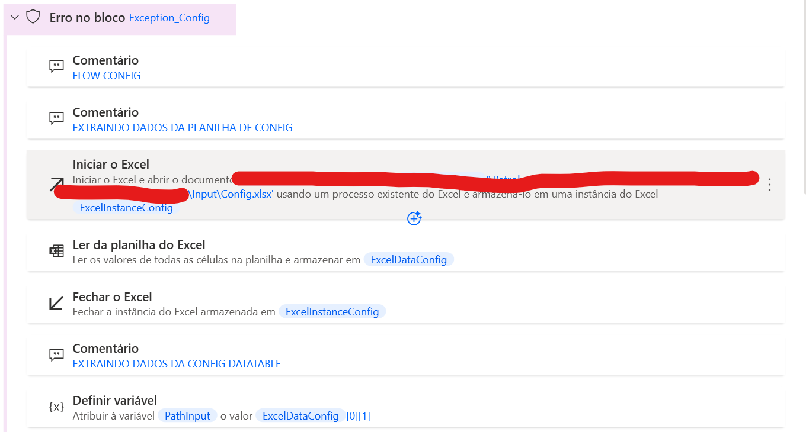
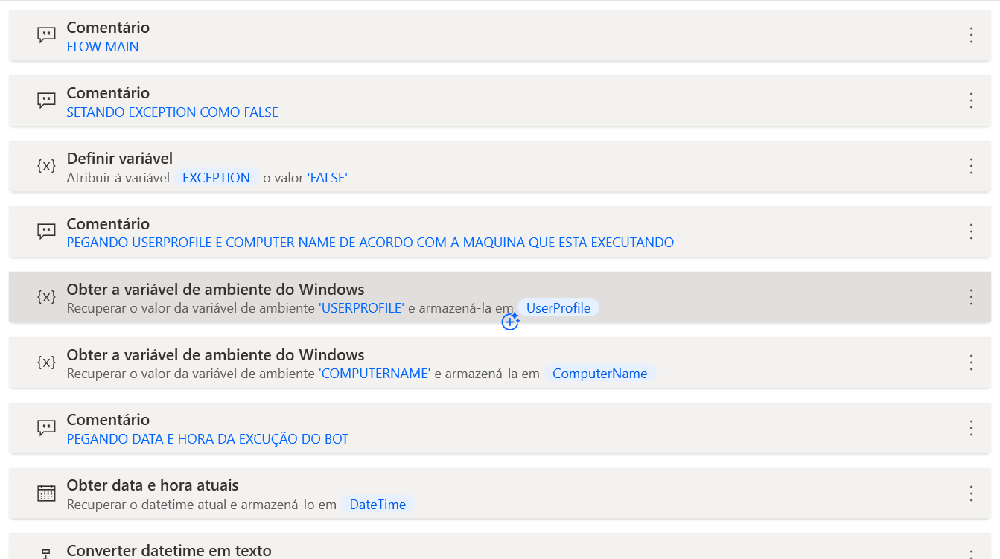

### Estrutura de Automação Power Automate Desktop
 

#### Subfluxo Config

 

### Subfluxo Main

 

#### Como usar 

- Copiar os textos dentro das strings """ dos arquivos .py e colar direto no subfluxo do Power Automate Desktop.